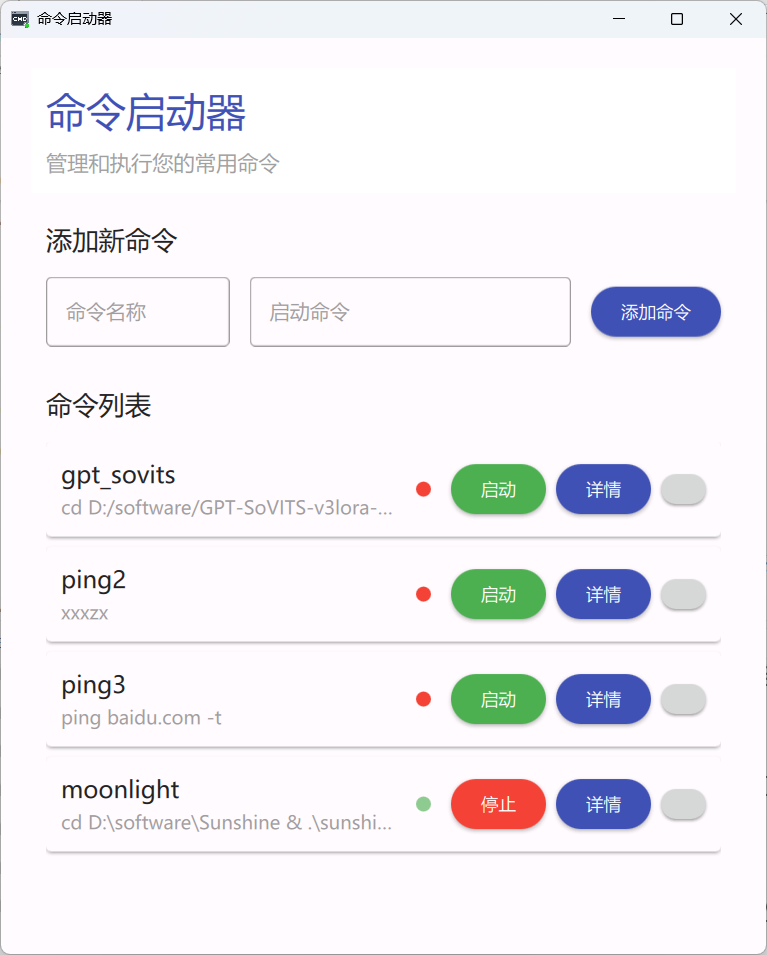
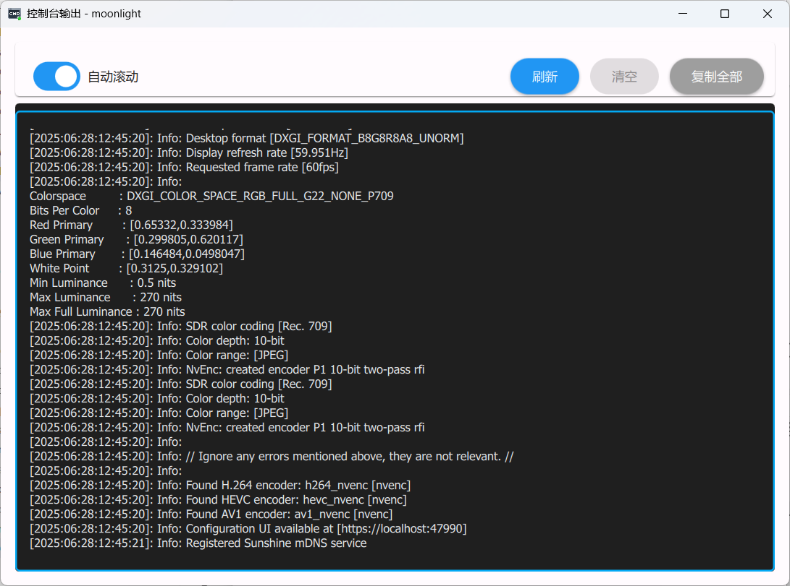

# RCmdLaunch - 命令启动器

一个基于Qt 6的现代化命令启动器应用程序，支持图形界面管理和执行命令，并提供系统托盘功能。

## 功能特性

- 🚀 **命令管理**: 添加、编辑和删除自定义命令
- 🎯 **一键执行**: 简单点击即可运行预设命令
- 📊 **实时输出**: 查看命令执行的实时输出
- 🎨 **现代界面**: 基于Material Design 3的美观界面
- 🔧 **系统托盘**: 最小化到系统托盘，便于后台运行
- 💾 **数据持久化**: 使用SQLite数据库保存命令配置

## 技术栈

- **界面框架**: Qt 6.9 (QML + Quick Controls 2)
- **开发语言**: C++ 17
- **数据库**: SQLite
- **构建系统**: CMake
- **设计风格**: Material Design 3

## 系统要求

- Qt 6.8 或更高版本
- CMake 3.16 或更高版本
- MinGW 或 MSVC 编译器

## 测试状态

✅ **已测试平台**:
- Windows 11 - 完全兼容，功能正常

## 界面展示

应用程序提供了简洁美观的Material Design界面，以下是主要界面截图：

### 主界面


主界面展示了命令列表管理功能，包括添加、编辑、删除和执行命令等操作。

### 输出详情


## 编译说明

### 前置要求

1. 安装Qt 6.8+开发环境
2. 安装CMake 3.16+
3. 安装MinGW或MSVC编译器

### 编译步骤

1. 克隆项目
```bash
git clone https://github.com/RayJinStudio/RCmdLaunch
cd RCmdLaunch
```

2.QT Creator
   使用Qt Creator打开项目文件，配置编译器和Qt版本。

## 使用说明

### 主界面

- **添加命令**: 点击"添加命令"按钮，输入命令名称和命令内容
- **编辑命令**: 点击命令条目的编辑按钮修改命令
- **删除命令**: 点击命令条目的删除按钮移除命令
- **执行命令**: 点击"启动"按钮执行命令
- **查看输出**: 点击"查看输出"按钮查看命令的实时输出

### 系统托盘

- 关闭主窗口时，程序自动最小化到系统托盘
- 双击托盘图标可重新显示主窗口
- 右键托盘图标可选择退出程序

### 命令管理

命令数据存储在SQLite数据库中，支持：
- 命令名称自定义
- 命令参数配置
- 执行状态监控
- 输出日志记录

## 项目结构

```
RCmdLaunch/
├── CMakeLists.txt          # CMake构建配置
├── src/
│   ├── cpp/                # C++源代码
│   │   ├── main.cpp        # 程序入口
│   │   ├── CommandManager.cpp/.h  # 命令管理器
│   │   └── TrayManager.cpp/.h     # 托盘管理器
│   ├── layout/             # QML界面文件
│   │   ├── Main.qml        # 主界面
│   │   ├── EditDialog.qml  # 编辑对话框
│   │   └── OutputDialog.qml # 输出对话框
│   └── res/                # 资源文件
│       ├── img/            # 图标资源
│       ├── resources.qrc   # Qt资源文件
│       └── app.rc          # Windows资源文件
└── build/                  # 构建输出目录
```

## 开发说明

### 核心组件

1. **CommandManager**: 负责命令的增删改查和执行管理
2. **TrayManager**: 处理系统托盘功能
3. **QML界面**: 使用Material Design风格的现代化界面

### 数据库结构

程序使用SQLite数据库存储命令信息，主要包含：
- 命令ID
- 命令名称
- 命令内容
- 创建时间
- 修改时间

## 许可证

本项目遵循 MIT License。

## 贡献

欢迎提交Issue和Pull Request来改进本项目。

---